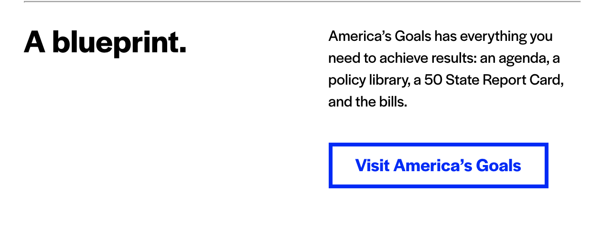
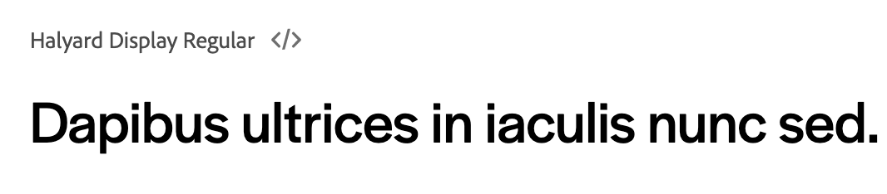
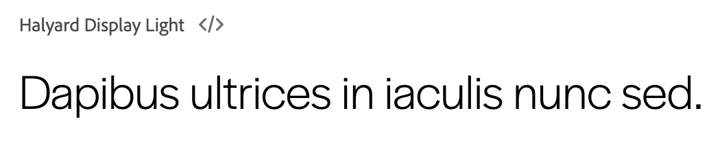
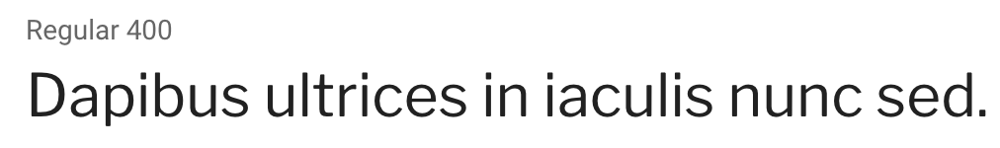

# Fonts Overview

We have two fonts:

* Druk Super
    * details: [commercialtype.com](https://commercialtype.com/catalog/druk/super)
    * more info: [typewolf.com](https://www.typewolf.com/site-of-the-day/fonts/druk)
* Halyard 
    * details: [fonts.adobe.com](https://fonts.adobe.com/fonts/halyard)
    * more info: [typewolf.com](https://www.typewolf.com/site-of-the-day/fonts/halyard)

---

## Druk

### Usage

Our usage of this font is limited to the font family "Druk Super" and we only use it in all capital letters. For example, our logos are "Druk Super":


And our buttons and headers:


We do not use this font in capital or lowercase instances.

### Free Alternatives

Typewolf suggests [Archivo Narrow](https://fonts.google.com/specimen/Archivo+Narrow) as an alternative to Druk, but there is no suggested alternative to the Druk Super family. [Archivo Black](https://fonts.google.com/specimen/Archivo+Black) is close option, but [Black Han Sans](https://fonts.google.com/specimen/Black+Han+Sans) might be a closer match. Using an alternative is not really an option, however, unless we are willing to rebrand the official logos away from the paid font.

---

## Halyard

### Usage

We use this font for the majority of our web text, including all paragraphs and some headers and buttons. I've noticed some instances where we lighten the weight of the font to 300 weight (400 is normal), but this is not a consistent practice. 



### Free Alternatives

Typewolf suggests [Libre Franklin](https://fonts.google.com/specimen/Libre+Franklin) as an alternative to Halyward. It appears to be a close match, and at regular weight appears to match the 300 weight Halyard that we use. Here are the three options: Halyard regular, light, and then Libre Franklin regular.





### CSS
```css
@font-face { 
    font-family:"Druk Super";
    font-style:normal;
    font-weight:400;
    src:url("FILE.woff") format("woff")
}
@font-face { 
    font-family:"Halyard";
    font-style:normal;
    font-weight:300;
    src:url("FILE.woff2") format("woff2")
}
@font-face { 
    font-family:"Halyard";
    font-style:normal;
    font-weight:400;
    src:url("FILE.otf") format("opentype")
}
@font-face { 
    font-family:"Halyard";
    font-style:normal;
    font-weight:600;
    src:url("FILE.otf") format("opentype")
}
```