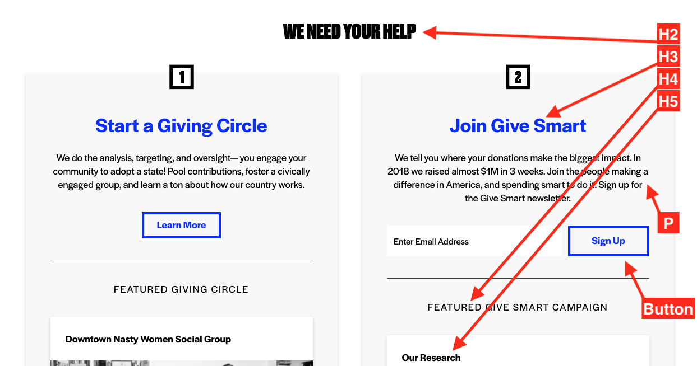

version: 1.0

# Config

* $base_value: 16px;
* $device_mobile: 750px;

---

# Colors

* $fnf_blue: hsla(234, 100%, 50%, 1); //#f8f8f8
* $fnf_black: hsla(0, 0%, 0%, 1); //#000000
* $fnf_red: hsla(0, 83%, 45%, 1); //#d01313
* $fnf_white: hsla(0, 100%, 100%, 1); //#ffffff
* $fnf_offwhite: hsla(0, 0%, 97%, 1); //#f8f8f8

---

# Fonts

* $font_head: "Druk Super",Impact,sans-serif;
* $font_text: "Halyard", Helvetica, sans-serif

---

# Personality

* border-width: 5px;
* $border-radius: 0;
* $box-shadow: hsla(0, 0%, 0%, 0.16);
* font-weight-normal: 400
* font-weight-bold: 700
* list-style-type: square

---

# Page

## Text 

### Paragraph

* 1.125rem

| | Font | Size | Color | Weight | Spacing | Margin | LineHeight |
| --- | --- | --- | --- | --- | --- | --- | --- |
| (D) | Halyard | 18px | black | normal | 0.65px | 0 0 20px 0 | 1.3 |
| (M) | "" | "" | "" | "" | "" | "" | "" |  

## Headers

### H1

* 3rem

| | Font | Size | Color | Weight | Spacing | Margin | LineHeight |
| --- | --- | --- | --- | --- | --- | --- | --- |
| (D) | Druk Super | 48px | black | normal | normal | 0 0 22px 0 | 0.97 |
| (M) | "" | "" | "" | "" | "" | "" | "" |  

* text-transform: uppercase;

### H2

* 2rem

| | Font | Size | Color | Weight | Spacing | Margin | LineHeight |
| --- | --- | --- | --- | --- | --- | --- | --- |
| (D) | Druk Super | 36px | black | normal | normal | 0 0 22px 0 | 0.97 |
| (M) | "" | "" | "" | "" | "" | "" | "" |  

* text-transform: uppercase;

### H3

* 2rem

| | Font | Size | Color | Weight | Spacing | Margin | LineHeight |
| --- | --- | --- | --- | --- | --- | --- | --- |
| (D) | Halyard | 36px | black | bold | normal | 0 0 22px 0 | normal |
| (M) | "" | "" | "" | "" | "" | "" | "" |  

### H4

* 1rem

| | Font | Size | Color | Weight | Spacing | Margin | LineHeight |
| --- | --- | --- | --- | --- | --- | --- | --- |
| (D) | Halyard | 16px | black | normal | 0.1em | 0 0 22px 0 | normal |
| (M) | "" | "" | "" | "" | "" | "" | "" |  

* text-transform: uppercase;

### H5

* 1.875rem

| | Font | Size | Color | Weight | Spacing | Margin | LineHeight |
| --- | --- | --- | --- | --- | --- | --- | --- |
| (D) | Halyard | 30px | black | bold | normal | 0 0 22px 0 | normal |
| (M) | "" | "" | "" | "" | "" | "" | "" |  

### H6

* 1.5rem

| | Font | Size | Color | Weight | Spacing | Margin | LineHeight |
| --- | --- | --- | --- | --- | --- | --- | --- |
| (D) | Halyard | 24spx | black | bold | normal | 0 0 22px 0 | normal |
| (M) | "" | "" | "" | "" | "" | "" | "" |  

---

## Buttons

base 0.75 / 16px
medium 1rem / 18px
large 1.25rem / 20px

border: 0.235em solid currentColor;
padding: 0.125em 0.5em 0.15em;
line-height: 1.5;
font-family: "Halyard";
font-weight: 600;

